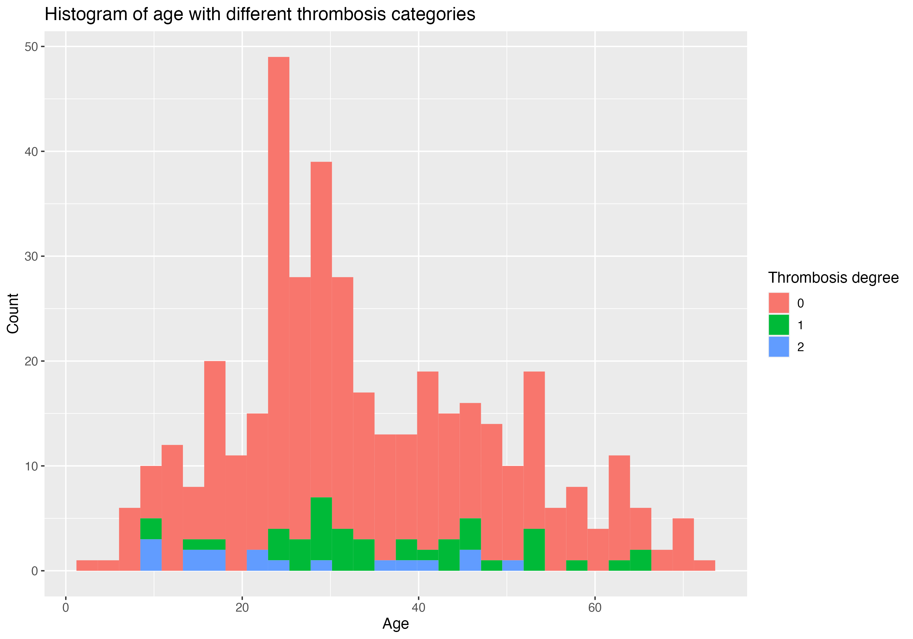
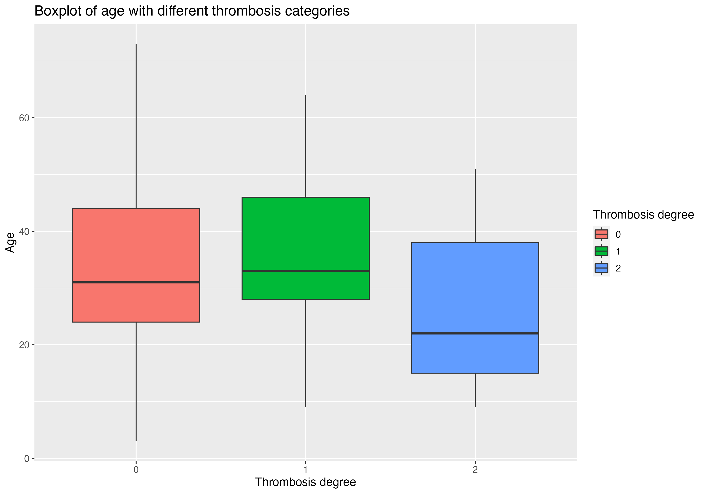
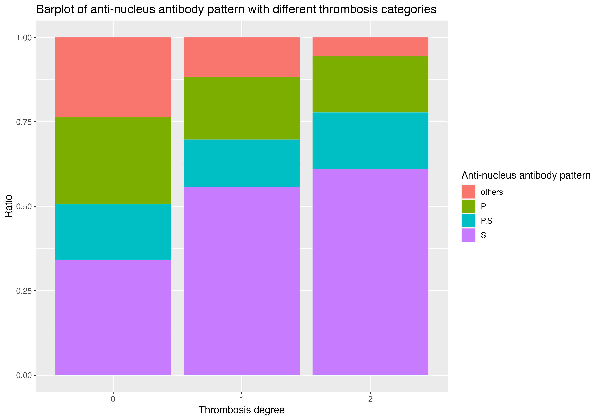
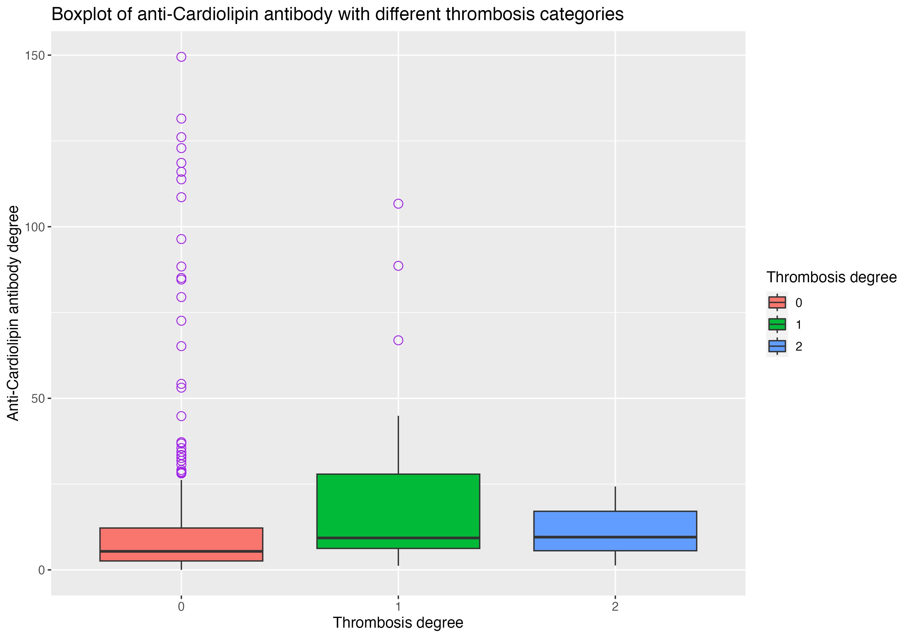
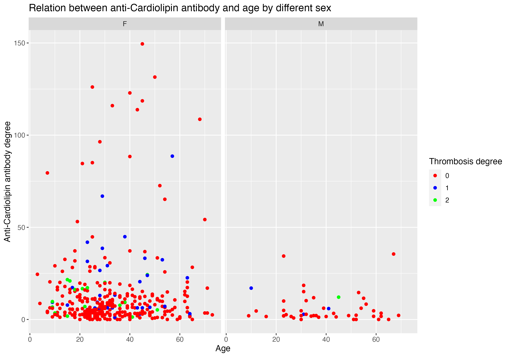

## About this project

This is an small assignment project of anly 503 (Advanced Data Visualization). I mainly used R to create different visualizations based on medical data and developed some data insights.

## Introduction

Collagen disease is a kind of auto-immune disease whose patients will generate antibodies to attack to themselves, which is harmful and dangerous to their bodies. Among all kinds of collagen diseases, thrombosis is the most important and severe, and it is also the major cause of death in collagen diseases. Therefore, it is important and necessary to detect and predict the possibilities of thrombosis. 

The goal of this study is to find possible factors that highly related to thrombosis according to patients’ special laboratory examination data. This study mainly discuss the patients’ ages, anti-nucleus antibody pattern, anti-Cardiolipin antibody degree and their relationships with thrombosis respectively.

## Analysis of patients' ages

Since Cardiovascular disease and hypertension tend to attack elder people more, it is natural to infer that ages of patients will influence their thrombosis degree. Thus, the first question we bring out for this study is: Does age influence the degree of thrombosis when the patients take the examinations?

<figcaption align = "center"><b>Image-01: This histogram shows the distribution of ages in three groups of patients, where 0 means negative thrombosis, 1 means positive and 2 means positive and severe.</b></figcaption>

\
According to this histogram, ages of patients with negative thrombosis seems to follow a normal like distribution with slight skewness. However, ages of positive patients distribute more evenly. We also notice that most patients whose degrees of thrombosis are positive and very severe (represented by '2') are below 50 years old. This suggests that age has relationship with thrombosis degree, however, it is adverse to our initial intuition that elders suffer more from this disease. In order to verify our finding, we create a boxplot of age as follows.

<figcaption align = "center"><b>Image-02: This boxplot more directly shows the distribution of ages within three categories of patients.</b></figcaption>

\
From this plot, we can see more clearly that the patients whose degrees of thrombosis are positive and very severe tend to have relatively smaller age than other two categories of patients.

## Analysis of anti-nucleus antibody pattern

The second question we want to consider is: Does observed pattern of anti-nucleus antibody highly relate to the degree of thrombosis?
Anti-nucleus antibody is a kind of antibody that will attack nucleus which contains our DNA. The observed pattern of anti-nucleus antibody is recorded during special laboratory examinations. There are different patterns of this antibody, including S, P and D. Also, some patients can be observed more than one pattern. According to the data set, most patients have pattern S, P or S&P.

<figcaption align = "center"><b>Image-03: This barplot shows the ratio of each patterns within different groups of patients.</b></figcaption>

\
According to this plot, we can clearly notice that the ratio of anti-nucleus antibody pattern within each of three groups of patients are very different. As degree of thrombosis gets more severe, proportion of pattern 'S' increases a lot, while proportion of pattern 'P' decreases. Therefore, we can conclude that anti-nucleus antibody is related to thrombosis degree. 

## Analysis of anti-Cardiolipin antibody

Our third question is: Is there a strong relationship between anti-Cardiolipin antibody and thrombosis?
Anti-Cardiolipin antibody is closely related with thrombosis, which was discovered by the medical physicians.

<figcaption align = "center"><b>Image-04: This boxplot shows the distribution of anti-Cardiolipin antibody degree of three different groups of patients.</b></figcaption>

\
From this plot, we can see that patients with negative thrombosis tend to have a lower average value of anti-Cardiolipin antibody. This suggest there exists certain relationship between degree of thrombosis and anti-Cardiolipin antibody and the more anti-Cardiolipin antibody, the higher possibility to have thrombosis.

## Other analysis

After investigating on the three questions above, I am also curious about the relationship between anti-Cardiolipin antibody and age. Will the degree of this kind of antibody increase or decrease over time? Additionally, I also consider the gender of patients in this analysis.

<figcaption align = "center"><b>Image-05: This scatter plot provides information for anti-Cardiolipin antibody and age within female and male respectively. The color of points represent different degree of thrombosis. </b></figcaption>

\
This plot provides much information. First, we can see that female patients are much more than male patients in this data set. Second and more important, we can not notify any obvious relationship between anti-Cardiolipin antibody and age. In different age periods, degrees of anti-Cardiolipin antibody seem to have similar distribution. Third, we can notice that patients with negative thrombosis (represented by red points) scatter more densely towards the x-axis, which means these part of patients have lower degree of anti-Cardiolipin antibody. This is consistent to the conclusion in last plot.

## Conclusion

Generally speaking, all of the three factors that we consider, patients’ ages, anti-nucleus antibody pattern, and anti-Cardiolipin antibody degree have relationship with thrombosis degree. First, Patients whose degrees of thrombosis are positive and very severe tend to have relatively smaller age. Second, as degree of thrombosis gets more severe, proportion of pattern 'S' increases a lot, while proportion of pattern 'P' decreases. Third, the more anti-Cardiolipin antibody, the higher possibility to have thrombosis.

This is what we have learned from the exploratory data analysis. It is still necessary to do further modeling to verify these conclusions and find more hidden information in order to analysis the mechanisms of collagen diseases.
